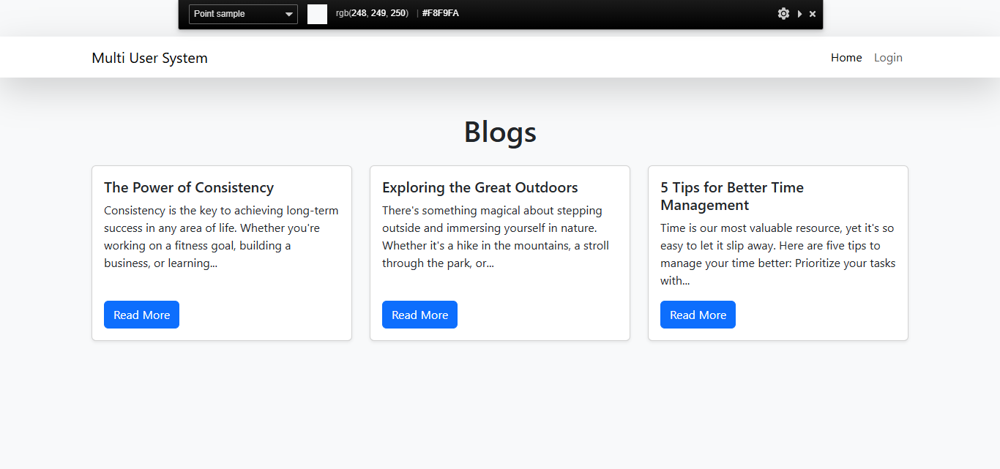
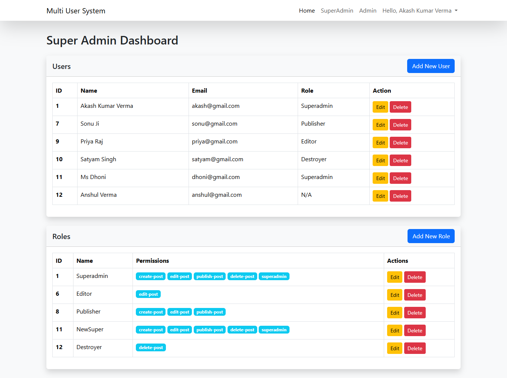
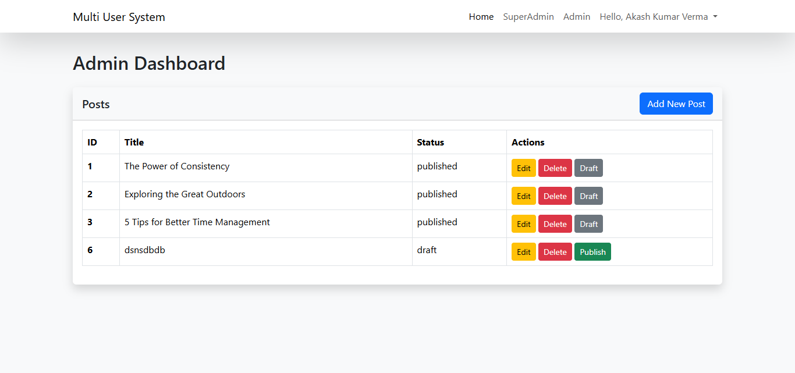

<<<<<<< HEAD
<<<<<<< HEAD
<p align="center"><a href="https://laravel.com" target="_blank"></a></p>

## About Multi User System

This project is a Multi-User System built using Laravel. The system allows users with different roles to interact with the application based on their permissions. Users can perform actions such as create, read, update, and post depending on their role.

## Features

<ul>
  <li>Role-based user management (admin, editor, viewer, etc.)</li>
  <li>Permissions control for each role </li>
  <li>CRUD operations for users based on roles </li>
  <li>Post creation and management </li>
  <li>User authentication and authorization</li>
  <li>MySQL database used for data storage.</li>
</ul>

## Requirements

-   **PHP >= 8.0**
-   **Composer**
-   **Laravel >= 11**
-   **MySQL >= 5.7**

## Setup Instructions

Follow these steps to set up the project locally:

### 1. Clone the Repository

```bash
# Replace <repository-url> with the actual repository URL
git clone <repository-url>
cd <project-directory>
```

### 2. Install Dependencies

Run the following command to install PHP dependencies:

```bash
composer install
```

### 3. Configure Environment

Copy the `.env.example` file to `.env`:

```bash
cp .env.example .env
```

Edit the `.env` file to match your local environment. Set the following:

-   **APP_URL**: The base URL for your application (e.g., `http://localhost`)
-   **DB_CONNECTION**: `mysql`
-   **DB_HOST**: `127.0.0.1`
-   **DB_PORT**: `3306`
-   **DB_DATABASE**: Your database name
-   **DB_USERNAME**: Your database username
-   **DB_PASSWORD**: Your database password

### 4. Run Database Migrations

Run the following command to set up the database schema:

```bash
php artisan migrate
```

### 5. Start the Development Server

Run the Laravel development server:

```bash
php artisan serve
```

The application will be available at `http://localhost:8000`.

## ScreenShot of Project

### 1. Home



### 2. Superadmin Dashboard



### 3. Admin Dashboard



## License

The Laravel framework is open-sourced software licensed under the [MIT license](https://opensource.org/licenses/MIT).
=======
# Project12
>>>>>>> 5fc341291538f85b98fd2ed066b91cf2611fe367
=======
# Project12
>>>>>>> 5fc341291538f85b98fd2ed066b91cf2611fe367
